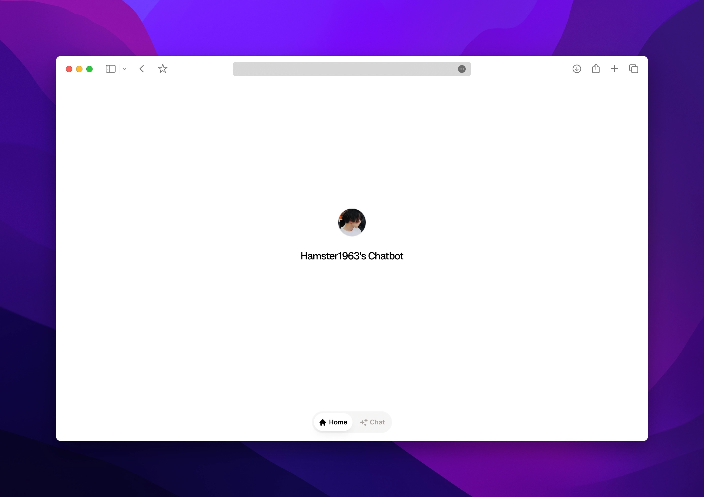

<h1 align="center">Next-Mini-Chat</h1>

<h3 align="center">Next-Mini-Chat 是一个基于 Next.js 的极致精简 Chat 页面</h3>
<h4 align="center">使用 Server Action 与中间件身份认证保证安全</h4>

### 一键部署到 Vercel

[编写中...](https://buycoffee.top/blog)

- **Framework**: [Next.js](https://nextjs.org/)
- **Language**: [TypeScript](https://www.typescriptlang.org/)

#### 环境变量

| 变量名                         | 含义                 | 示例                             |
| ------------------------------ | -------------------- | -------------------------------- |
| OPENAI_BASE_URL                 | openai API Base地址       | https://models.inference.ai.azure.com            |
| OPENAI_API_KEY                   | API 密钥 | ghp_***** |
| OPENAI_MODEL | 选用模型 | **默认**：gpt-4o-mini                   |
| SITE_TITLE           | 站点名称         | Hamster1963's Chatbot                  |
| SITE_USERNAME     | 用户名     | trio                |
| SITE_PASSWORD | 密码           | pleasechangeme |

 

